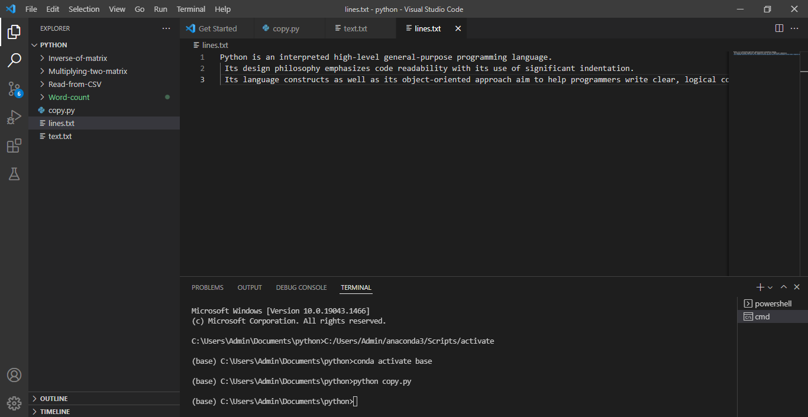

# copy-file
## AIM:
To write a python program for copying the contents from one file to another file.
## EQUIPEMENT'S REQUIRED: 
PC
Anaconda - Python 3.7
## ALGORITHM: 
### Step 1:


### Step 2: 
 
### Step 3: 

### Step 4:  

### Step 5: 

### Step 6: 

## PROGRAM:
```
'''Reference no:21004872
   Developed by:V.NAVYA'''
with open('text.txt','r') as file1:
    with open('lines.txt','w') as file2:
        for lines in file1:
            file2.write(lines)
```
### OUTPUT:




## RESULT:
Thus the program is written to copy the contents from one file to another file.